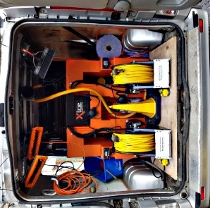
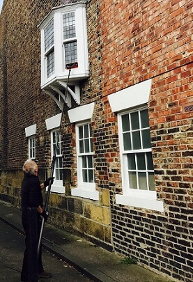

# Window Cleaning in Newcastle upon Tyne

Window Cleaning NE offer domestic and commercial window cleaning services in Newcastle upon Tyne.

## Our Areas 
## Gosforth - Jesmond - Kenton-Kingston Park -  Quayside - South Gosforth  - Spital Tongues - High- Heaton - Heaton - Great Park - Four Lane Ends - Forest Hall - Fenham - Fawdon - Benton

Our top quality, hot pure water pole-fed window cleaning guarantees a perfect, streak free finish for both the windows and the window frames & the long reach pole system means no more impossible-to-reach areas & mobile unit means easy access where vehicles are not permitted.

## Quality Equipment
We use the latest in reverse osmosis, pure water pole-fed cleaning systems.

Why? Well, it means no more impossible-to-reach places. No more streaky windows & no more ladders!

Oh and we can even reach those Velux windows that you’ve never been able to clean!

## Simple Pricing
Simplicity and honesty. Good things, right? That’s why we offer a standard, simple pricing structure.

The price we say is the price you pay. No nasty surprises.

## Satisfaction Guaranteed
Love the results or we’ll do it again – for free.

We’re so confident that you’ll love the results that if you’re not, we’ll do them again or refund you.
